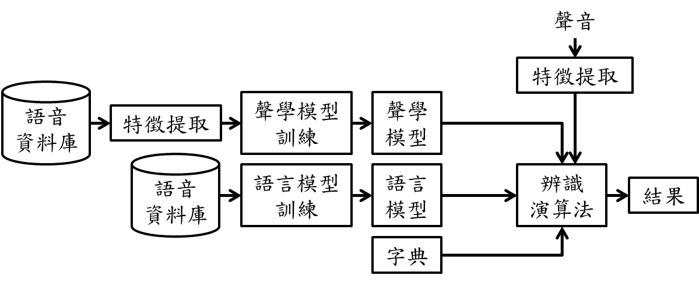
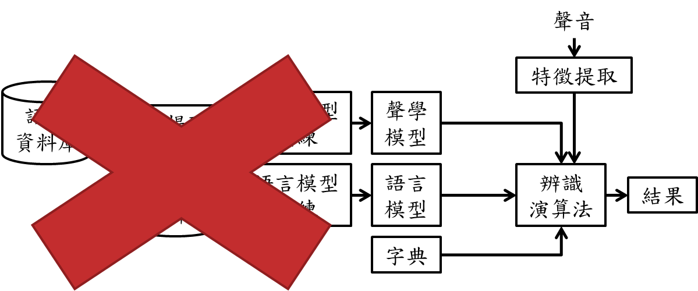
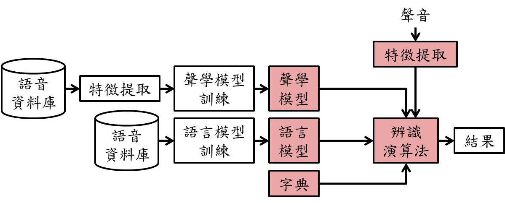
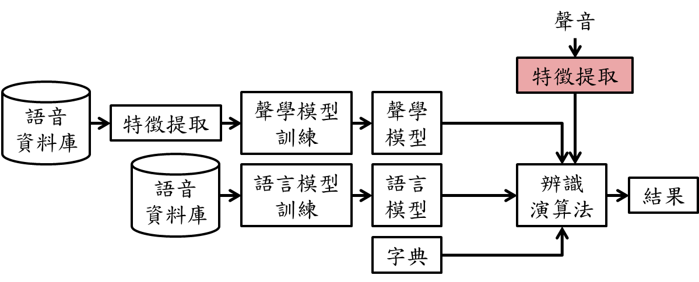
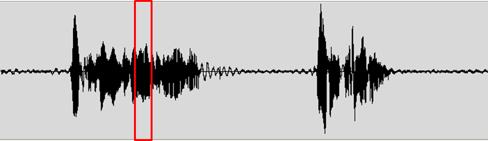
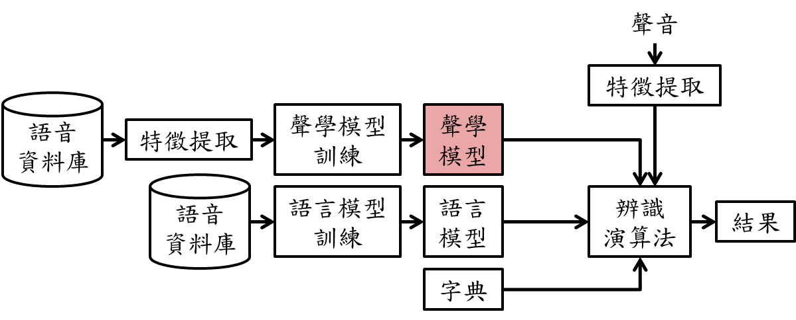
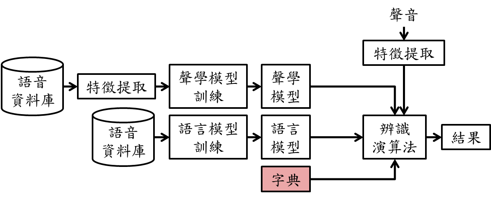
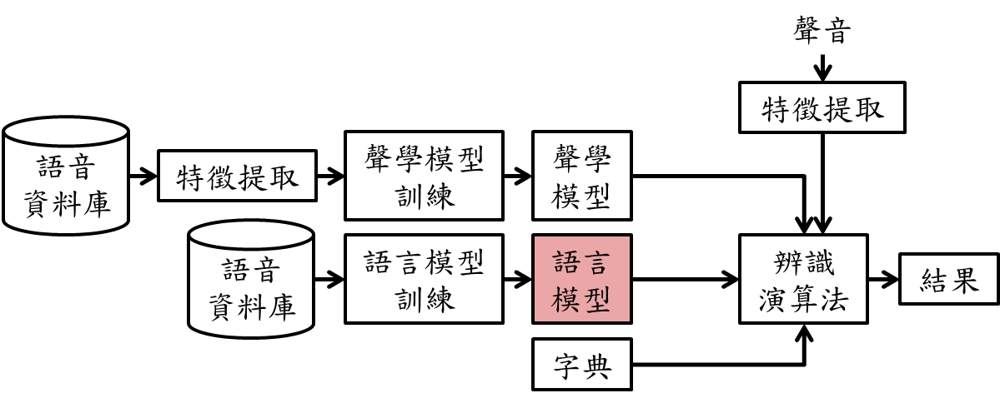
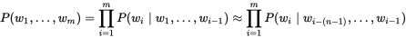
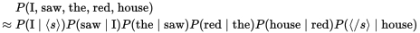

title: 把語音辨識用在自走車上是否搞錯了什麼？ 
author: Gundam

%%%%%%%%%%%%%%%%%%%
% Use '%' to comment or directive (ex:css below)

%%%%%%%%%%%%%%%%%%%
%% You can add some custom style rules here...

%css

.many_subtitle h2 {
    margin-top: 15% !important;
}

.step.slogen h2 {
    margin-top: 20%;
}

.step.center-list ul, .step.center-list ul {
    display:table; margin:0 auto;
}

%end

%%%%%%%%%%%%%%%%%%%
!SLIDE slide x=0 y=0 z=0

## 把語音辨識用在自走車上是否搞錯了什麼？ 

#### Gundam

%%%%%%%%%%%%%%%%%%%
!SLIDE slide x=1200 y=0 z=0 slogen center-list

## 關於我

 * 自稱**鋼彈**

 * 南大資工畢業

 * 關於這[簡報作法](http://slides.pastleo.me/SITCON_2016_myStyle/#/step-1)

%%%%%%%%%%%%%%%
!SLIDE slide x=2400 y=0 z=0

## 今天要講什麼故事？

%%%%%%%%%%%%%%%
!SLIDE slide x=2400 y=700 z=0

## 與語音辨識相遇

%%%%%%%%%%%%%%%
!SLIDE slide x=2400 y=1400 z=0

## 歪腦筋動到樹莓派上

%%%%%%%%%%%%%%%
!SLIDE slide x=2400 y=2100 z=0

## 覺得放到自走車上好像可以

%%%%%%%%%%%%%%%
!SLIDE slide x=2400 y=2800 z=0

## 但車子好像聽不懂我的話

%%%%%%%%%%%%%%%
!SLIDE slide x=2400 y=3500 z=0

## 優化中順便學習語音辨識的理論

%%%%%%%%%%%%%%%
!SLIDE slide slide x=2400 y=4200 z=0

## 影片獻醜時間

%%%%%%%%%%%%%%%
!SLIDE x=1200 y=4200 z=0 rotate=90 center-list

## 與語音辨識相遇

 * 跑去工讀剛好要做的東西是語音辨識

 * 認識了**pocketshpinx**

%%%%%%%%%%%%%%%
!SLIDE x=0 y=4200 z=0 rotate=90 center-list

## 歪腦筋動到樹莓派上

 * 剛好那學期有修嵌入式系統

 * 但是不想用系上的板子

 * 老師，我可以拿其他板子玩嗎

 * 老師表示 : 是`ARM`架構都行

%%%%%%%%%%%%%%%
!SLIDE x=-1200 y=4200 z=0 rotate=90 center-list

## 覺得放到自走車上好像可以

 * 在網路上買樹莓派的時候看到自走車

 * 然後看到這[影片](https://www.facebook.com/ONEWSin/videos/vb.783907228340584/807285906002716/?type=2&theater)

 * 好像很好玩

 * **好坑不跳嗎？**

%%%%%%%%%%%%%%%
!SLIDE x=-2400 y=4200 z=0 rotate=90 center-list

## 但車子好像聽不懂我的話 

 * 程式好像很快就寫好了

 * 但我說右轉為什麼往左邊轉QAQ

 * `森氣氣`

%%%%%%%%%%%%%%%
!SLIDE x=-3600 y=4200 z=0 rotate=90 center-list

## 優化中順便學習語音辨識的理論

 * 懂的人拜託鞭小力點><

 * 聽不懂我在說啥的也多提問題

 * (因為可能我也似懂非懂所以講錯了QAQ)

%%%%%%%%%%%%%%%
!SLIDE x=-3600 y=3500 z=-2400 rotate=180 center-list

## Pocketsphinx架構簡介 

 * 聲音模型

 * 字典

 * 語言模型

%%%%%%%%%%%%%%%
!SLIDE x=-3600 y=2100 z=-2400 rotate=180 picture

%%%%%%%%%%%%%%%
!SLIDE x=-4800 y=4200 z=-4800 rotate=180 picture

%%%%%%%%%%%%%%%
!SLIDE x=-6000 y=6300 z=-7200 rotate=180 picture

%%%%%%%%%%%%%%%
!SLIDE x=-7200 y=8400 z=-9600 rotate=180 picture

%%%%%%%%%%%%%%%
!SLIDE x=-3600 y=1400 z=7200 rotate=90 center-list

## 特徵提取

 * [MFCC(Mel-Frequency Cepstrum)](https://zh.wikipedia.org/wiki/%E6%A2%85%E5%B0%94%E9%A2%91%E7%8E%87%E5%80%92%E8%B0%B1%E7%B3%BB%E6%95%B0)

 * 10毫秒一個frame

 * 轉成39個數字 => 特徵向量

%%%%%%%%%%%%%%%
!SLIDE x=-2400 y=2100 z=9600 rotate=90 scale=2 picture

%%%%%%%%%%%%%%%
!SLIDE x=-2400 y=3500 z=9600 rotate=90 picture

%%%%%%%%%%%%%%%
!SLIDE x=-2400 y=4200 z=12000 center-list

## 聲音模型

 * 音節

 * 音素

 * HMM(隱式馬可夫模型)

%%%%%%%%%%%%%%%
!SLIDE x=-2400 y=5600 z=12000 center-list

## 聲音模型

 * 音節
   - ma-mi

 * 音素
   - m-a

%%%%%%%%%%%%%%%
!SLIDE x=0 y=5600 z=12000 rotate=-90

## HMM(隱式馬可夫模型)

#### [數學不好，只好拿圖解釋(裝逼)](http://www.csie.ntnu.edu.tw/~u91029/HiddenMarkovModel.html)

%%%%%%%%%%%%%%%
!SLIDE x=1200 y=5600 z=12000 rotate=-90 center-list

## HMM(隱式馬可夫模型)

 * 算出可能的音素音節

 * 然後呢

%%%%%%%%%%%%%%%
!SLIDE x=1200 y=11200 z=12000 rotate=-180 picture

%%%%%%%%%%%%%%%
!SLIDE x=2400 y=11200 z=12000 rotate=-180 center-list

## 字典

 * 聲音轉成字詞

 * S AH N D EY => sunday

%%%%%%%%%%%%%%%
!SLIDE x=3600 y=11200 z=12000 rotate=-180 picture

%%%%%%%%%%%%%%%
!SLIDE x=4800 y=11200 z=12000 rotate=-180

### 以為有字詞就結束了嗎

### 發音很像怎麼辦

%%%%%%%%%%%%%%%
!SLIDE x=4800 y=5600 z=6000 center-list

## 例如這樣

 * It’s a nice day?

 * It sun niced A?

 * It son ice day?

%%%%%%%%%%%%%%%
!SLIDE x=7200 y=5600 z=0 rotate=90 center-list

## 語言模型

 * N-Gram

 * 3-Gram

 * P(w3\| w2, w1)

%%%%%%%%%%%%%%%
!SLIDE x=8400 y=4200 z=0 rotate=90 center

## 又拿圖來解釋(裝逼)

%%%%%%%%%%%%%%%
!SLIDE x=9600 y=4800 z=2400 rotate=270 center-list

## 結果出爐

 * **It’s a nice day?**

 * It sun niced A?

 * It son ice day?

%%%%%%%%%%%%%%%
!SLIDE x=4800 y=2100 z=4800 rotate=90 scale=3

## [影片獻醜時間](https://www.youtube.com/watch?v=ZJntNTvb_g8)

%%%%%%%%%%%%%%%
!SLIDE x=4800 y=2100 z=9600 center-list

## 參考資料

 * [语音识别的基础知识与CMUsphinx介绍](http://blog.csdn.net/zouxy09/article/details/7941585)

 * [Basic concepts of speech](http://cmusphinx.sourceforge.net/wiki/tutorialconcepts)

 * [演算法筆記](http://www.csie.ntnu.edu.tw/~u91029/HiddenMarkovModel.html)

 * [Wiki - Language model](https://en.wikipedia.org/wiki/Language_model#n-gram_models)

%%%%%%%%%%%%%%%
!SLIDE x=0 y=0 z=12000 scale=5

## Q & A

%%%%%%%%%%%%%%%
